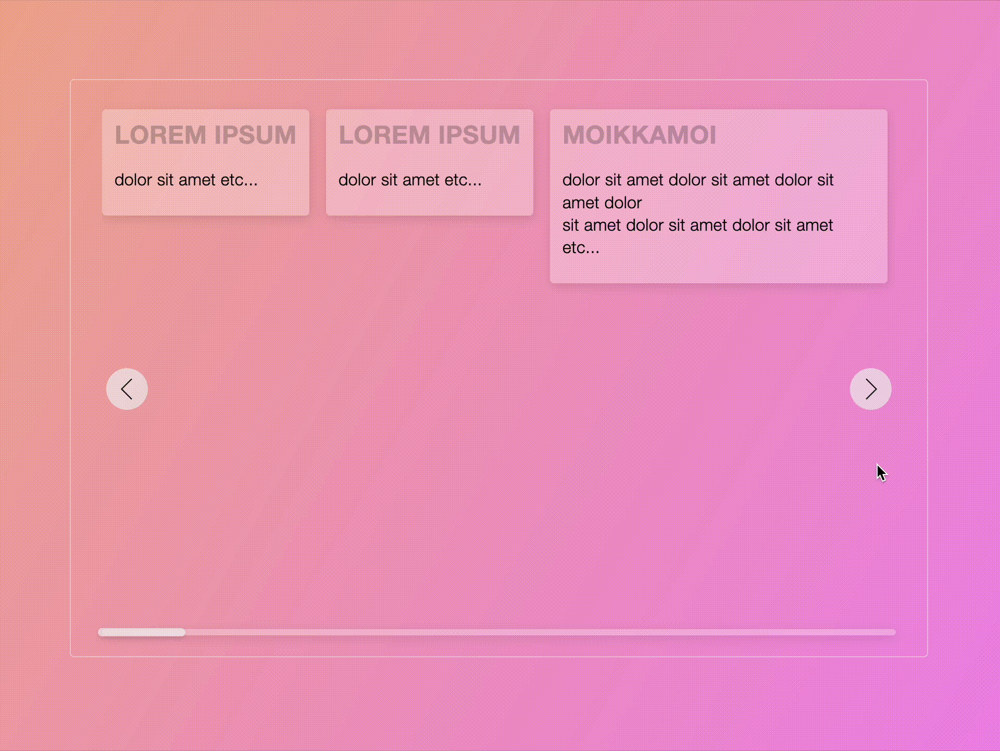
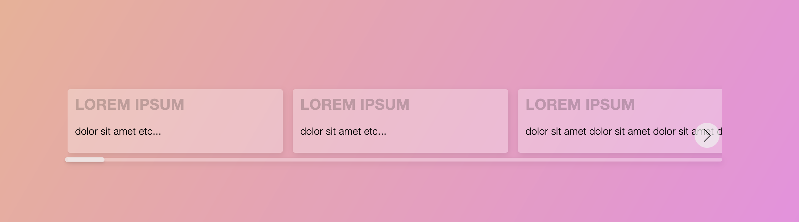

# react-element-carousel

[](https://forthebadge.com) [](https://forthebadge.com) [](https://forthebadge.com) [](https://forthebadge.com)

*NOTE* This is not yet published in npm so just copy the source or smth if you need this right now ❤︎❤︎❤︎❤︎❤︎

React component for displaying content in horizontal scrollable container. Supports dragging w touch gestures and cool stuff like that.

## How it feels like

Here's a VR™️ experience of the component:



## How to use

Import the component and provide the required props. Component's only allowed & required prop is `children` which has to be an array (idk why children – should probably change it to something that makes more sense. it's super annoying w single item carousels (like there would be need for one anyway 🛼))

| Prop | required | type |
|---|---|---|
| children | true | React.ReactNode[] |

```jsx
import Carousel from 'react-element-carousel'

const App = () =>
  <Carousel>
    <div>First slide</div>
    <div>Second slide</div>
    <div>…</div>
  </Carousel>
```

The end result ***is*** _stellar_:



This is all for the reqular *Joe* user! Sorry for the giant png tho...

---

## Development

`npm start` starts the dev server

### Publishing

Build the whole damn ting like `npm run build` :D

To check the types run `npm run type-check` but you should be using IDE that does linting n stuff for u u know uwu

### Contributing

Fork n' roll and we'll see if your changes'll get approved 👮‍♀️

Best Regards,

-- - - ✂ - -- - - ✂ - -

TUꞤDꝚⱯ

---

[](https://forthebadge.com)
